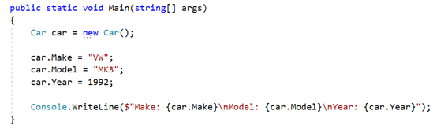

# 1. Car

Create a public **class** named **Car** within the namespace **CarManufacturer** :

| **Car.cs** |
| --- |
| namespace CarManufacturer { &nbsp;&nbsp;&nbsp;&nbsp;&nbsp;&nbsp;class Car  &nbsp;&nbsp;&nbsp;&nbsp;&nbsp;&nbsp;{ &nbsp;&nbsp;&nbsp;&nbsp;&nbsp;&nbsp;&nbsp;&nbsp;&nbsp;&nbsp;&nbsp;&nbsp; // TODO: define the Car class members here … &nbsp;&nbsp;&nbsp;&nbsp;&nbsp;&nbsp;} } |

Define in the above class **private fields** for:

- **make: string**
- **model: string**
- **year: int**

The class should also have **public properties** for:

- **Make: string**
- **Model: string**
- **Year: int**

Create a public class **StartUp** class within the same namespace **CarManufacturer** to hold your program's entry point:

| **StartUp.cs** |
| --- |
| namespace CarManufacturer { &nbsp;&nbsp;&nbsp;&nbsp;&nbsp;&nbsp;publicclass StartUp  &nbsp;&nbsp;&nbsp;&nbsp;&nbsp;&nbsp;{ &nbsp;&nbsp;&nbsp;&nbsp;&nbsp;&nbsp;&nbsp;&nbsp;&nbsp;&nbsp;&nbsp;&nbsp;static void Main() &nbsp;&nbsp;&nbsp;&nbsp;&nbsp;&nbsp;&nbsp;&nbsp;&nbsp;&nbsp;&nbsp;&nbsp;{ &nbsp;&nbsp;&nbsp;&nbsp;&nbsp;&nbsp;&nbsp;&nbsp;&nbsp;&nbsp;&nbsp;&nbsp; &nbsp;&nbsp;&nbsp;&nbsp;&nbsp;&nbsp;// TODO: define the Main() method here ... &nbsp;&nbsp;&nbsp;&nbsp;&nbsp;&nbsp;&nbsp;&nbsp;&nbsp;&nbsp;&nbsp;&nbsp;} &nbsp;&nbsp;&nbsp;&nbsp;&nbsp;&nbsp;} } |

You should be able to use your **Car** class like this: 

