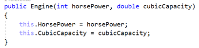
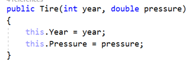
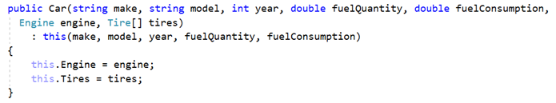
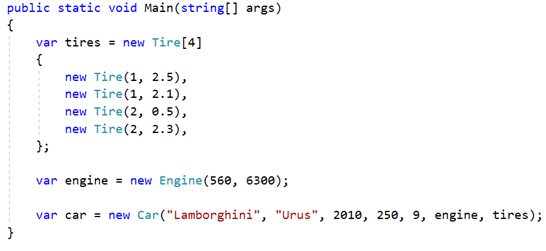

# 4. Car Engine and Tires

Using the Car class, you already created, define another class **Engine**.

The class should have private fields for:

- **horsePower: int**
- **cubicCapacity: double**

The class should also have properties for:

- **HorsePower: int**
- **CubicCapacity: double**

The class should also have a constructor, which accepts **horsepower** and **cubicCapacity** upon initialization:

Now create a class **Tire**.

The class should have private fields for:

- **year: int**
- **pressure: double**

The class should also have properties for:

- **Year: int**
- **Pressure: double**

The class should also have a constructor, which accepts **year** and **pressure** upon initialization:

Finally, go to the **Car** class and create **private fields** and **public properties** for **Engine** and**Tire[]**.Create another constructor, which accepts **make, model, year, fuelQuantity,fuelConsumption, Engine** and **Tire[]** upon initialization:

You should be able to use the classes like this:

